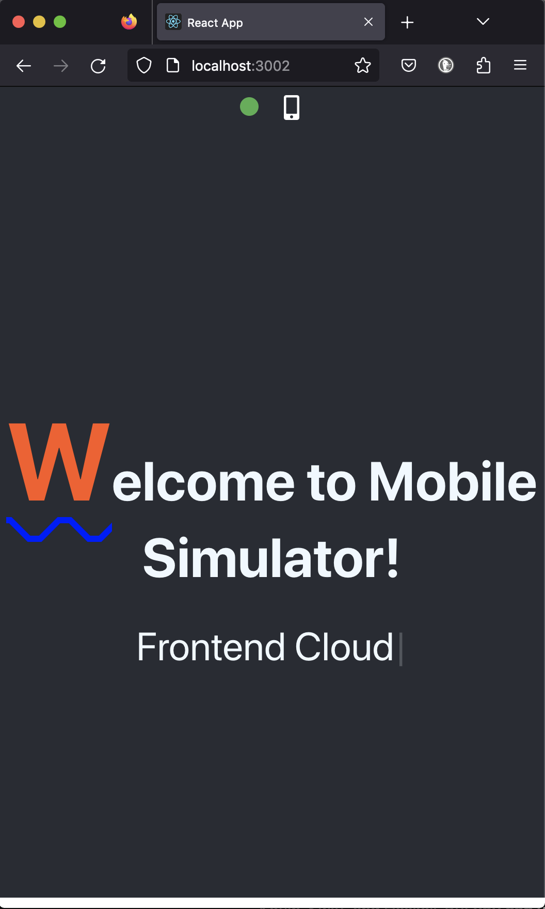
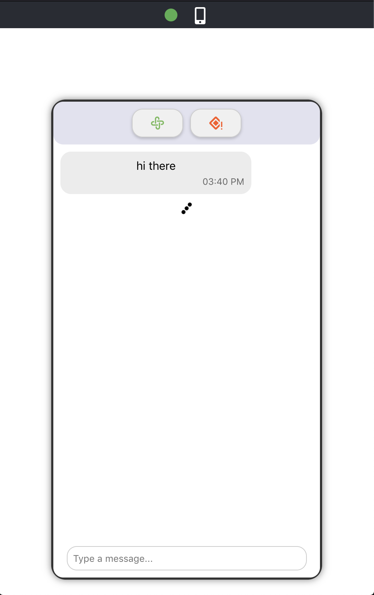
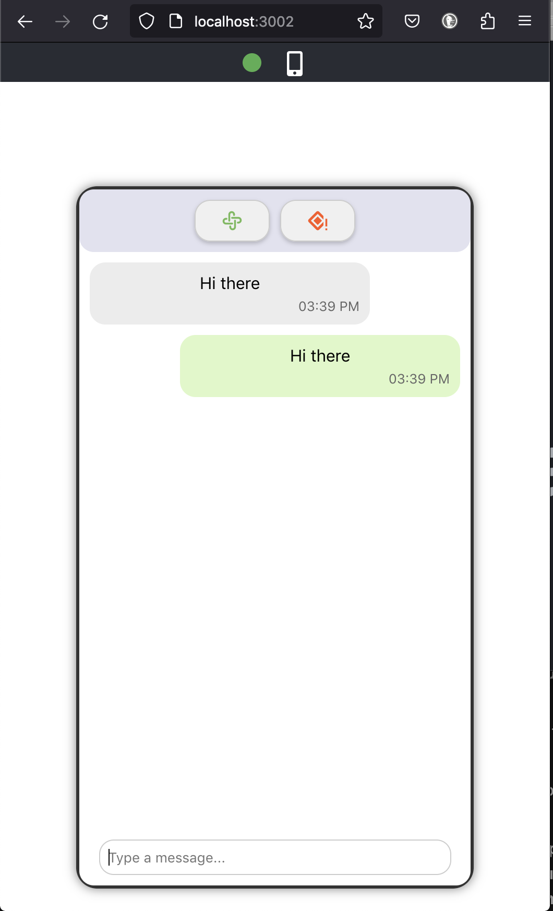

# ChatAPP

This is a contrived chat demo application with the sole purpose of demonstrating and illustrating the usage of various backend and frontend technologies
for both web and mobile.  





# Go

Go for the backend. Go (or Golang) has several intrinsic features that distinguish it from other programming languages. 
Here is an overview of some of the most notable features:

1. Compiled Language 

    Go is compiled to machine code, which means programs generally execute faster than those in interpreted languages. 
    The Go compiler is known for its 25+ times faster compilation times.

2. Static Typing 

    Go is a statically-typed language, which means that type information is explicit and checked at compile time.


3. Standard Library +
    
    Go comes with a comprehensive standard library that provides a wide array of helper and utility functions. On top of that, there is a variety of extensions, packages and 
    whole frameworks that are built on top of Go.
    

4. Platform Agnostic

    Go has a cross-platform compiler, which means you can develop on one OS (e.g., MacOS) and compile for another (e.g., Linux) with ease.
    

5. Simplicity 

    Go's syntax is clean and concise, which makes it easy to read and write. The language emphasizes simplicity over features, and as a 
    result, there are no classes, no generics , and no exceptions.

6. Concurrency Parallelism Performance 

    Go has a built-in support for concurrent programming with `go routines` and `go channels`. 
    This makes it easier to write programs that perform multiple tasks simultaneously and on top of that, being a compiled language, Go 
    offers performance benefits.  
   
7. Garbage Collection 

    Go includes garbage collection, which automatically re-allocates memory that is no longer used reducing the need to manage memory explicitly like in other hight-level languages. 

8. Embedded Dependency Management
    
    With the introduction of Go modules, Go has built-in dependency management, making it easier to handle external libraries and ensuring reproducible builds.

9. Interfaces and Type Embedding

    Instead of traditional inheritance, Go uses interfaces and type embedding for code reuse and polymorphism.
    
   
10. Community and Corporate Support

    Finally, Go and its extension libraries are well-documented and have a strong community support as well as backing by Google, the creator of Go.
 

# Web Frameworks for Go

   While Go's standard library already provides a solid foundation for building web servers and handling HTTP requests, there are 
   various third-party frameworks and libraries available to use to leverage Go's power even further. 
   There are about dozens of Go frameworks available in the marketplace each one with different features, philosophies, and trade-offs.
   For this chatApp, the Gin framework is used. 


## Gin 

   Gin (https://gin-gonic.com/) is a fast and minimalist framework that provides a martini-like API but with better performance due to its ability to work
   with HTTP *routers*. It offers features like middleware support, JSON validation, and rendering.
 

## Go and Gin Installation 

If you are using macOs 10.14 (Mojave) or older and installing Go for the first time, you will likely need to update homebrew and Xcode prior to installing Go.
Also, see paragraph below about macOs 10.14 and Reactive Native, which will further requires upgrades and updates of the macOs and the dev tool sets.
Once Go is installed, installing Gin and setting up an initial Gin project is straightforward. 

## First Hello, World! with Go 

`hello.go`

```
package main

import "fmt"

func main() {
    fmt.Println("Hello, World!")
}
```

In a command line, run `go run hello.go`. You should see "Hello, World!" printed to the console.

## Gin Backend Setup 

In the root folder of a project:

1. Create a new Go module:

>go mod init Gin

2. Install Gin

>go get -u github.com/gin-gonic/gin

The above command adds dependencies to Go.mod:

>cat go.mod

```
module Gin
go 1.21.3

require (
	github.com/bytedance/sonic v1.10.2 // indirect
	github.com/chenzhuoyu/base64x v0.0.0-20230717121745-296ad89f973d // indirect
	github.com/chenzhuoyu/iasm v0.9.1 // indirect
	github.com/gabriel-vasile/mimetype v1.4.3 // indirect
	github.com/gin-contrib/sse v0.1.0 // indirect
  ...
)
```
 
3. Create your main.go file and any additional supporting files required for you Gin server. 
    Review the source code on this GitHub repository for examples. More details explaining the server-side code for the
    Chat app in the subsequent sections of this readme.
     
4. Running Gin server


>go run main.go

```
[GIN-debug] [WARNING] Creating an Engine instance with the Logger and Recovery middleware already attached.

[GIN-debug] [WARNING] Running in "debug" mode. Switch to "release" mode in production.
 - using env:	export GIN_MODE=release
 - using code:	gin.SetMode(gin.ReleaseMode)

[GIN-debug] GET    /                         --> main.main.func1 (3 handlers)
[GIN-debug] [WARNING] You trusted all proxies, this is NOT safe. We recommend you to set a value.
Please check https://pkg.go.dev/github.com/gin-gonic/gin#readme-don-t-trust-all-proxies for details.
[GIN-debug] Environment variable PORT is undefined. Using port :8080 by default
[GIN-debug] Listening and serving HTTP on :8080

```

5. Test Gin Endpoint in the the browser!
 
In the browser enter the URL localhost:8080. This will create a GET HTTP request at a service running on port 8080. 
This will be process bu the Go/Gin app running on port 8080. 
If the Go project is properly setup, you should see the following text in the browser:
 
{"message":"Hello, World!"}

 
## Debugging Go/Gin application

1. Install `Go` package in VS Code

2. It may also prompt to install additional tools:

Tools environment: `GOPATH=~/go`


# Hosting 

The options for hosting in the cloud are abundant. Here I will cover Vercel (https://vercel.com)

What does Vercel give you:

1. Hosting services for the cloud.

2. Support for Mono-repos.

3. Host static sites and *serverless* functions including Go!

4. Continuous deployment from Git, both on `feature` and `main` branches including deployment for every push.

5. Promotion to production.

6. Free SSL certificates.

7. Preview deployments for every push.


Before choosing a hosting service, it's important to understand the differences between static and dynamic web applications and serverless backends as the support for those varies significantly.
 
1. Static Web Apps 

    These are typically comprised solely of HTML, CSS, and JavaScript files that are served as they are stored, without any 
    server-side processing. They are usually used for websites where the content doesn't change dynamically based on user
    input or server-side processing. Static site generators like Jekyll, Hugo, or Gatsby are commonly used to build static websites.

2. Dynamic Web Apps 

    Dynamic web apps, in contrast, involve server-side processing. They can generate HTML content on the fly, 
    interact with databases, and perform complex logic before sending responses to the client. 
    This is the category into which Gin applications fall.


3. Serverless Backend

   A serverless backend, also known as *backend as a service* or *functions as a service* and similar to the cloud-based applications, serverless hosting providers offer a variety of backend functions like routing, api gateways, data and authentication as service. Developers can subscribe and then pick the functions they need based on their app requirements.
   This is exactly the paradigm followed for this mini project. 

* Gin Web App vs Go Serverless

    Gin is a web framework for Go that allows for the creation of dynamic web applications. It can handle routing, middleware, and templating, among many other things. 
    When you use Gin (or any similar web framework), you're creating a dynamic web server that can respond to HTTP requests with dynamically generated content.

* Go Serverless and Vercel
 
1. Create the Serverless Functions 
   This page describes how to use Go run-time with `Serverless Functions` in Vercel

2. NOTE: For production deployments to Vercel, you will need to remove the Gin Framework Dependency. More about this later.

3. Deployment to Vercel 

   You will need to configure Vercel. One way of doing this is using a vercel..json configuration file to map your routes to the 
   corresponding serverless functions in your Go Serverless app.
   Example:

    ```
    {
        "version": 2,
        "builds": [
            { "src": "index.go", "use": "@vercel/go" },
        ],
        "routes": [
            { "src": "/", "dest": "index.go" },
        ]
    }

    ```

4. Deployment

    After setting up your serverless functions and the vercel.json configuration file, you can deploy your project to Vercel.

5. Developing and testing Serverless Functions on a local machine

   Write your serverless functions as you normally would. In the case of Go, these would be functions that handle HTTP requests.


## Go core concepts 

1. What is a Go module?

A Go module is a collection of Go packages stored in a file tree with a go.mod file at its root. 
The go.mod file defines the module's module path, which is also the import path used for the root directory, and its dependency 
requirements, which are the other modules needed for a successful build.

Modules were introduced (Go 1.11) as a response to some of the challenges that Go developers faced regarding dependency management. 
Prior to modules, Go used a workspace-based approach (GOPATH), which had some limitations, particularly around versioning and managing external dependencies.

Here are some key features and benefits of using Go modules:

* Versioning 

    Modules support versioning, which allows developers to specify the versions of external dependencies they need.
    This helps in maintaining consistent builds and avoids "dependency hell."

* Reproducibility 

    Modules ensure that all developers working on a project, as well as the deployment pipelines, use the exact same versions of dependencies, 
    making builds reproducible.

* Decentralization

    Modules do not require a centralized repository of packages. They can be fetched directly from their source repositories (like GitHub),
    tagged with version numbers.

* Compatibility 

    The Go team designed modules to be backward compatible with pre-existing Go code that does not use modules.

* Simplified Workflow 

    Modules eliminate the need for setting a GOPATH and allow for a more straightforward workflow, especially for those coming 
    from other languages and package management systems.

* Module Initialization

    To initialize a new module, you use the command go mod init <module path>, where <module path> is typically the repository location where your code will be stored.
    This command creates a new go.mod file in the current directory. The go.mod file tracks your code's dependencies and their versions.

* Adding Imports

    When you add imports to your Go files that are not in the standard library and then build or test your code, Go will automatically update the go.mod file 
    to include those new dependencies. You can also manually adjust dependencies using various go mod commands.


Overall, Go modules have become the standard and recommended way to manage Go code and its dependencies.

In a web app that uses Gin or any other Go framework, whether you use a single Go module or multiple Go modules depends on the size and complexity of your application, 
as well as your team's preferences for managing dependencies.
Here are some considerations for each approach:

* Single Module Approach

For many applications, especially smaller or medium-sized ones, a single Go module is sufficient. This approach keeps things simple:

- You have a single go.mod file at the root of your project that tracks all dependencies.
- All your Go code lives under one module.
- It's straightforward to manage and update dependencies since they are all centralized.
- Builds and tests are simpler to run as they operate on the entire module.

* Multiple Module Approach

In larger applications, or in cases where different parts of the application have different lifecycle or dependency requirements, you 
might opt for multiple Go modules.
This is sometimes seen in microservices architectures or in monorepos containing multiple services or components. 
Here's what this might entail:
 
- Each service or component has its own go.mod file and is treated as a separate Go module.
- Dependencies are managed per module, which allows for more granular control and can help minimize the impact of dependency updates.
- Different modules can evolve independently, and versioning can be applied at a module level.

The decision to use a single module or multiple modules depends on your project's needs. For many web applications, particularly 
those just starting out, a single Go module is a straightforward and effective choice. As the application grows in size and complexity, 
you might consider breaking it down into multiple modules to better manage dependencies and versioning.

    

# Chat App

This explain what to install and run the Chat app demo locally. 
To run the chat app locally, clone the repo and navigate to the project's root directory where it was cloned

>git clone git@github.com:beetlet/chatApp.git

## Gin

This is the Go web frameworks used for development and testing locally. See previous sections for details installing Gin.

To run the Chat App backend service you also need to install the gorilla/websocket package: 

>go get github.com/gorilla/websocket

Please refer to the documentation: https://pkg.go.dev/github.com/gorilla/websocket@v1.5.1

Run Gin:

>go run main.go 

You should see the following message printed to the screen:

```[DATE time] Server is starting on port 8080...```


## Web client

`CD .\web`

>yarn install

>yarn start

This should run the GO application and open the React web client in the browser.


--

